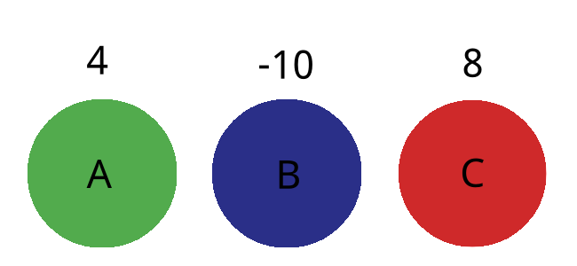
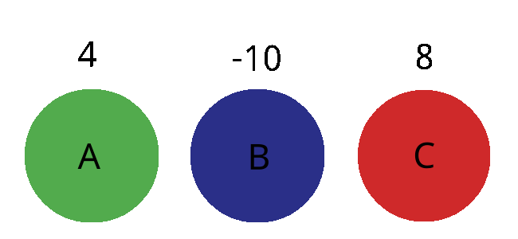
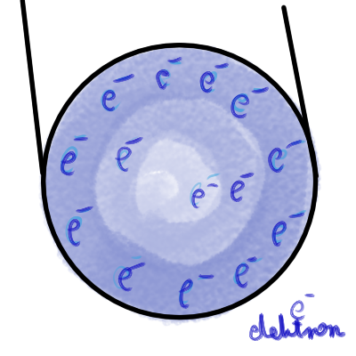
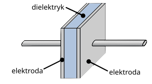

# Ładunki elektryczne
Ładunkiem elektrycznym nazywamy ciało, które jest naładowane ładunkiem elektrycznym dodatnio lub ujemnie.
Ładunki elektryczne występują w dwóch wersjach (dodatnie i ujemne).

Ciała obojęne elektrycznie mają tyle samo elektronów i protonów. 
Elektrony mogą "przeskakiwać" między atomami. 

Elektrony mają ładunek ujemny (-), więc ciało które ma więcej elektronów jest nałądowane ujemnie. 
Protony mają ładunek dodatni (+), więc ciało które ma mniej elektronów jest nałądowane dodatnio. 

Ładunki elektryczne o tym samym znaku odpychają się, a ładunki o tym samym znaku odpychają się.
# Zasada zachowania ładunku
**"W każdym zamkniętym układzie ciał suma ładunków się nie zmienia"**

Oznacza to, że gdy mamy ciała A B i C o ładunkach następno 4, -10, 8 w izolowanym układzie, to nie ważne co się stanie suma ładunków w tym układzie pozostanie taka sama. 

Przy dotknięciu się ciał ładunki na tych ciałach się wyrównają (będą identyczne). Więc np. zetknięcie ciał o ładunkach 10 i -10 spowoduje, że oba ciała będą miały ładunek równy 0. Zetknięcie ciał o łądunkach 50 i 0 spowoduje, że oba będą miały ładunek 25. 

Wracając do przykładu policzmy sumę ładunków ciał A, B i C
4 + (-10) + 8 = 2

Teraz załóżmy, że ciała A i B się zetkną. Ładunki się wyrównają na oby do  (4 + (-10)) / 2 = -6/2 = -3
czyli ciała mają teraz ładunki -3, -3, 8

zatem ich suma to: -3 + (-3) + 8 = 2

Suma ładunków pozostaje stała.
# Prawo Coulomba
Prawo Coulomba jest opisem siły jakie działają na ciała posiadające ładunek. Wyraża się go wzorem:

Wyjaśnienie symboli:
* F  =>  to siła przyciągania między ładunkami [w Newtonach]
* k  => to stała, która ma określoną wartość w przybliżeniu 9*10^9
* q1 => to wartość pierwszego ładunku [w Coulombach]
* q2 => to wartość drugiego ładunku [w Coulombach]
* r    => to odległość między ładunkami [w metrach]

# Pole elektryczne
Jest to opis wartości siły jaka działa na ładunki w przestrzeni.

# Klatka Faradaja
Jest to konstrukcja wykorzystująca fakt, że łądunki w przewodnikach przemieszczają się po zewnętrznej ich części. Jest to nazywane "efektem skóry".
Poniżej przekrój przewodu z zaznaczonymi elektronami.

Klatka Faradaja wykorzystuje ten efekt i pozwala odprowadzić ładunki elektryczne po swojej powierzchni.
Blokuje ona również fale elektromagnetyczne.
## Zastosowania: 
* piorunochrony
* kuchanki mikrofalowe

# Kondensator
Jest to bierny element elektryczny. Pozwala on na zgromadzenie ładunku i późniejsze oddanie go. 
## Budowa kondensatora:

Kondensatory zbudowane są z dwóch okładek (elektrod) będących przewodnikiem i dielektryka, który jest zrobiony z izolatora. Ladunki zbierają się na dwóch elektodach i przyciągają się do siebie, ale nie mogą ze względu na dielektryk.

## Symbol kondensatora:

Kondensatory mają określoną pojemność wyrażaną w Farradach.